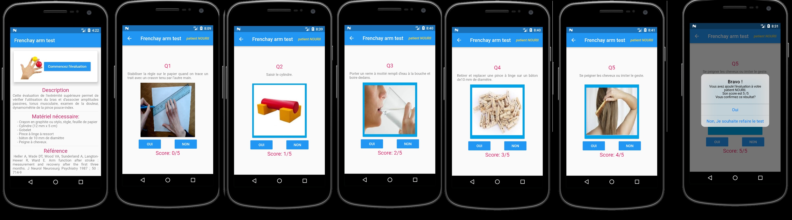

# Frenchay Arm Test

C'est un outil utilisé par les Kinésithérapeutes pour faciliter l'évaluation de leurs patients.
Frenchay Arm Test est une évaluation fonctionnelle des patients (en particulier les victimes d'un Accident vasculaire cérébral (AVC).
Ce Test permet de vérifier l’utilisation du bras et d'associer amplitudes passives, tonus musculaire, examen de la douleur, dynamométrie de la pince pouce-index.

## Ref

RÉFÉRENTIEL D’AUTO-ÉVALUATION DES PRATIQUES PROFESSIONNELLES EN MASSOKINÉSITHÉRAPIE
https://www.has-sante.fr/upload/docs/application/pdf/Evaluation_%20fonctionnelle_%20AVC_ref.pdf